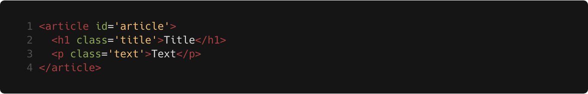
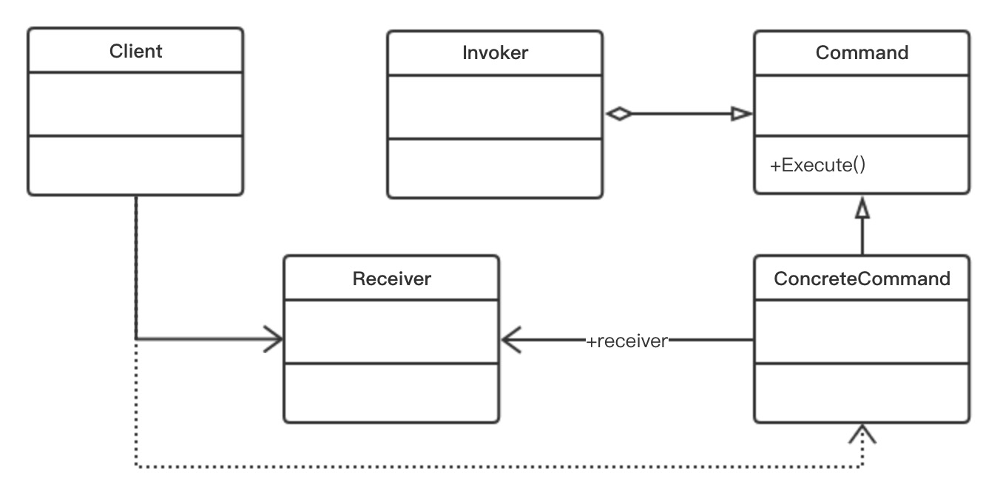

# 基于 React， Redux 和 Webpack 的前端优化方案

## 摘要

随着互联网技术的极速发展，人们的生活越来越离不开互联网，随之而来的是公众对用户体验的要求越来越高。前端开发技术的发展能够大大简化开发者的开发难度，从而减少开发者的开发成本并且网站的整体质量。本文主要探讨在前端开发领域方面的应用，利用 React、Redux 和 Webpack 的深度整合，来优化网页的性能和质量，在更小的打包体积下极大提升网站的响应速度和兼容性。论文主要包括使用 React 进行组件化开发，使用 Redux 管理复杂的单页 Web 应用（SPA）中的换数据和运行状态，并且使用 Webpack 对项目进行打包优化。之后根据以上理论构建出一个 SPA 云音乐客户端来研究在具体项目中通过 React、Redux 和 Webpack 来优化网站的整体性能。

## 论文关键词

React、Redux、Webpack、前端开发、网站优化

Front-end optimization solution based on React, Redux and Webpack

## ABSTRACT

Author:Shi anqi
Tutor:Xing yi

With the rapid development of Internet technology, people's lives are increasingly inseparable from the Internet, followed by the ever-increasing demand from the public for user experience. The development of front-end development technology can greatly simplify the development of developers, thereby reducing the developer's development costs and the overall quality of the site. This article mainly discusses the application in the front-end development field, uses the deep integration of React, Redux, and Webpack to optimize the performance and quality of web pages, and greatly improves the responsiveness and compatibility of the web site under a smaller package size. The thesis mainly includes the use of React for component development, the use of Redux to manage complex single-page Web applications (SPA) that require frequent data exchange and running state, and use Webpack to package and optimize the project. Based on the above theory, a SPA cloud music client was built to study the overall performance of the website through React, Redux, and Webpack in specific projects.

Keywords: React, Redux, Webpack, Front End Development, Website Optimization

## 第一章：绪论

### 选题背景及研究意义

随着互联网的快速发展，人们对互联网的依赖也变得越来强。不论是在科研机构，商业领域还是个人生活，我们无时无刻不在直接或者间接的与计算机进行交互。然而随着业务需求越来越复杂，用户需要的界面和数据的交互也越来越繁杂。编写传统的 HTML、CSS、JavaScript 页面的复杂度越来越大，维护成本也随之成倍的提高，往往一个小小的改动就要花费很长的时间去修改。此外各个企业之间的竞争越来越大，为了提升用户体验，并且应对多变的市场环境，各个公司也在不断探寻更好的前端技术。前端技术的发展程度关系到各行各业共同的利益，也关系到我们每个人的上网体验。所有的这些方面，都促使前端技术必须不断的发展，来适应日益增长的需求。

前端技术的发展，从1991年 Tim Berners-Lee 公开提及 HTML 描述，到1994年网景推出了第一版 Navigator，同年为动态 web 网页设计的服务端脚本 PHP 诞生。1995年网景推出了 JavaScript，实现了客户端的计算任务。再到1999年 W3C 发布 HTML4，网页的出现是为了更好的交流彼此的想法。与此同时，整个 IT 行业的概念和雏形逐渐形成。

再到 2004年10月的 Web2.0 大会，Blog，Wiki，RSS 各种网站逐渐走进大家的视野。2006年8月，jQuery 的第一个版本发布，其优雅的语法、事件驱动型的编程思维使其极易上手，因此很快风靡全球。开源社区出现了大量基于 jQuery 的相关工具，这更加稳固了 jQuery 的地位。

但随着 W3C 规范和标准进一步推动，大家对 Web 页面复杂度进一步的加剧，人们不再满足于 jQuery 面条式的开发，各种用于简化客户端开发的框架层出不穷，诸如 Backbone，Ember，AngularJS，React，Vue 等等各种各样的框架，其中最为出色的莫过于 React，一经开源，广受开源社区的好评。在这之后，Vue 凭借广大的中国开发者强势崛起。AngularJS2 也完成发布。主流的 JavaScript 开发框架也形成了三足鼎立之势（React，Vue，AngularJS）。与此同时，在我们看不到的背后，浏览器第二次大战打响，V8 引擎开始大放异彩，Web 标准也在推动 ECMAScript5.0 进化着。node.js 发布了，意味着我们前端的领域已经拓展到服务端了。构建打包工具也默默的不停迭代，Grunt 的辉煌不复存在，Gulp 刚刚兴起，Webpack 的浪潮就席卷而来，并在 2016年成为了主流的前端构建工具。

从二十世纪的兴起，到现在的短短十几年发展，就已经表现出了强大的生命力，到目前发展来看，前端开发技术的发展时间相对较短，但是发展速度却非常快，并且技术的迭代也十分迅速，这和当前互联网的极速发展有着密不可分的关系。一个稳定、流畅、对用户友好的前端界面往往能够给用户带来非常良好的使用体验，能够极大的提升用户的满意度。文本所研究的基于 React、Redux 和 Webpack 的前端优化方案，正是对当前主流前端开发技术的深度整合和性能优化，基于本方案能够在减少开发者开发难度的同时，极大的优化网页的性能和质量，在更小的打包体积下极大提升网站的响应速度和兼容性，获取更好的用户体验。

### 论文的主要内容

本文主要研究网站前端优化方案，通过 React、Redux 和 Webpack 框架的深度整合和性能优化，在减少开发者开发难度的同时来优化网页的性能和质量，在更小的打包体积下极大提升网站的响应速度和兼容性。论文包括五个部分，每一部分的内容组织如下：

* 第一章是绪论，主要介绍了论文的选题背景以及研究意义，包括当前前端技术的发展现状以及发展历程，并在最后介绍了全文的内容安排。
* 第二章是对本文相关概念的进行阐述，并且对本文主要涉及的相关技术进行深入的探讨。
* 第三章是全文的重要部分，分为三小节，分别阐述了系统的设计与实现，对系统开发和生产环境下的优化方法，以及对系统进行自动化测试和持续集成。
* 第四章是对第三章提出的方法的性能分析，主要通过对网站各项性能指标进行对比，来评估此优化方案所带来的性能提升。
* 第五章是论文的结论，指出文章的研究结果和局限性。

## 第二章：相关技术分析

本文主要涉及到的技术为 React、Redux 和 Webpack。React 主要用于构建 UI；Redux是一个应用数据流框架，用来保存和管理整个应用的状态；而 Webpack 是一个模块打包工具，它用来分析项目结构，找到 JavaScript 模块以及其它的拓展语言（Scss，Jsx等），并将其转换和打包为合适的格式供浏览器使用。

### React

React 是一个用于构建用户界面的 JavaScript 库，起源于 Facebook 的内部项目，用来架设 Instagram 的网站，并于 2013 年 5 月开源，一经开源，广受开源社区的好评。React 能有如今的火爆程度，和它拥有如下的的特点是密不可分的：

1. **声明式设计** - React 采用声明范式，可以轻松描述应用。
1. **高效** - 通过使用虚拟 DOM，能够减少不必要的 DOM 的交互，从而提高性能。
1. **灵活** - 可以与已知的库和框架很好的配合。
1. **组件化** - 天生的组件化思维，用过组件的方式使代码复用变得十分容易。能够十分容易的构建大型项目。
1. **单向响应的数据流** 数据流动方向可以跟踪，流动单一，利于追踪问题。

我们知道，DOM 操作是非常耗时的，如果我们把一个简单的 div 元素属性都打印出来，你会看到如下的结果，因为比较长，这里只粘贴了约 1/5。

```javascript
const arr = []
const div = document.createElement('div')
for (var key in div) {
  arr.push(`[${key}]:${div[key]}`)
}
console.log(arr.join(' '))
```

```text
[align]: [title]: [lang]: [translate]:true [dir]: [dataset]:[object DOMStringMap] [hidden]:false [tabIndex]:-1 [accessKey]: [draggable]:false [spellcheck]:true [contentEditable]:inherit [isContentEditable]:false [offsetParent]:null [offsetTop]:0 [offsetLeft]:0 [offsetWidth]:0 [offsetHeight]:0 [style]:[object CSSStyleDeclaration] [innerText]: [outerText]: [onabort]:null [onblur]:null [oncancel]:null [oncanplay]:null [oncanplaythrough]:null [onchange]:null [onclick]:null [onclose]:null [oncontextmenu]:null [oncuechange]:null [ondblclick]:null [ondrag]:null [ondragend]:null [ondragenter]:null [ondragleave]:null [ondragover]:null [ondragstart]:null [ondrop]:null [ondurationchange]:null [onemptied]:null [onended]:null [onerror]:null [onfocus]:null [oninput]:null [oninvalid]:null [onkeydown]:null [onkeypress]:null [onkeyup]:null [onload]:null [onloadeddata]:null [onloadedmetadata]:null [onloadstart]:null [onmousedown]:null [onmouseenter]:null [onmouseleave]:null [onmousemove]:null [onmouseout]:null [onmouseover]:null [onmouseup]:null [onmousewheel]:null [onpause]:null [onplay]:null [onplaying]:null [onprogress]:null [onratechange]:null [onreset]:null [onresize]:null [onscroll]:null [onseeked]:null [onseeking]:null [onselect]:null [onstalled]:null [onsubmit]:null [onsuspend]:null [ontimeupdate]....
```

然而这只是第一层，真正的 DOM 元素是非常庞大的。而且操作的时候要非常的小心，可能一个轻微的触碰，就会导致整个页面重排，这就是影响性能的罪魁祸首。
[](https://github.com/livoras/blog/issues/13)

相对于直接对 DOM 进行操作，对原生的 JavaScript 操作就非常快了，而且更加简单，所以我们可以用一个简单的 JavaScript 对象来表示 DOM 节点：

```javascript
var element = {
  tagName: 'div', // 节点标签名
  props: {        // DOM的属性，用一个对象存储键值对
    id: 'article',
  },
  children: [     // 该节点的子节点
    {tagName: 'h1', props: {class: 'title'}, children: ["Title"]},
    {tagName: 'p', props: {class: 'text'}, children: ["Text"]},
  ],
}
```

<!--  -->

上面的虚拟 DOM 节点对应的HTML写法是：

```html
<div id='article'>
  <h1 class='title'>Title</h1>
  <p class='text'>Text</p>
</div>
```

<!--  -->

既然原来的 DOM 树可以用 JavaScript 对象表示，那么反过来也可以用这个 JavaScript 对象来还原 DOM 树。

那么我们就可以用 JavaScript 对象表示 DOM 信息和解构，当状态发生变化的时候，我们可以用新的对象树和旧的对象树进行比较，记录这两棵树的差异。记录下来的不同的就是我们需要真正更新的 DOM 元素。然后将其应用到真正的 DOM 树上，页面就更新了。

这就是所谓的 Virtual DOM 算法，包括如下步骤：

* 用 JavaScript 对象表示 DOM 树的解构；然后用这个树构建一个真正的 DOM 树，插到文档中。
* 当状态更新的时候，重新构造一棵新的树。然后用新的树和旧的树对比，记录两棵树的差异。
* 把所记录的两棵树的差异应用到真实的 DOM 上，视图就更新了。

Virtual DOM 本质上就是在 JavaScript 和 DOM 之间做了一个缓存。可以类比 CPU 和内存，既然频繁读写内存这么慢，那么我们可以在 CPU 上加入 Cache Memory 来加速这一操作。

### Redux

React 是一个 UI 库，单靠 React 不足以搭建一个完整的 web 应用。2014年，Facebook 发布了 Flux 就提供了一种架构思想。2015年 Redux 出现，将 Flux 和函数式编程结合在一起，成为了一时前端框架的热门。Redux 的出现就是为了解决复杂场景下的业务逻辑设计的，如果是简单的业务逻辑，可以完全不使用 Redux。

为了便于管理和跟踪状态，在 React 中数据是单向流动的，也就是数据总是从父组件传递到子组件的。如果子组件想更新父组件的状态，只能通过父组件给子组件暴露的方法。所以数据由始至终都是从父组件流向子组件，我们称为单向数据流。

这也是深层次的组件之间通讯困难的原因：数据的传递是单向的，子组件的数据只能就近获取，但是真正的数据源却离得太远，没有捷径可以直接通知数据源更新状态。而 Redux 的出现改变了 React 的这种窘迫处境，它提供了整个应用的唯一数据源 store，这个数据源是随处可以访问的，不需要靠父子相传，并且还提供了（间接）更新这个数据源的方法，并且是随处可使用的！

Redux 借鉴了设计模式中的命令模式（Command Pattern），将一个请求封装成一个对象，从而让你使用不同的请求把客户端参数化，对请求排队或者记录请求日志，可以提供命令的撤销和恢复功能。



理解了命令模式，理解 Redux 就容易多了，但我们首先要理解这四个概念： store、action、reducer、dispatch


* Store 就是保存共享数据的地方，你可以把它看成一个容器。整个应用只能有一个 Store。
* Action 是用来描述当前发生的事情。State 的变化，会导致 View 的变化。但是，用户接触不到 State，只能接触到 View。所以，用户想要改变 State 需要通过一个媒介来完成，这个媒介就是 Action，用户每一次请求改变状态都会产生一个相应的 Action。
* Reducer 是处理 Action 的地方，是一个函数，它接受 Action 并且根据当前的 State，返回一个新的 State。
* Dispatch 是 View 通知 Reducer 接收 Action 的唯一方法。

所以整个数据流就变成这样：整个应用的共享数据存在 Store 中， React 根据 Store 和自身的 State 渲染出 View。当用户想更新 Store 中的数据，则要生成相应的 Action，并且调用 store 所暴露出的 dispatch 方法，将 Action 传递给 Reducer 。Reducer 接收到 Action 并且根据当前的 State，返回一个新的 State 去更新 Store 中的数据。从而再由 React 更新 View。

### Webpack

随着前端的发展，现有很多网站都能看做是一个功能丰富的应用，他们拥有着复杂的 JavaScript 代码和一大堆相关依赖。为了简化开发的复杂度，前端社区出现了很多好的实践方法。

* 模块化，将复杂的程序细化为小的代码片段
* 类似 TypeScript 这种在 JavaScript 基础上拓展的开发语言：使我们能够实现目前版本 JavaScript 不能直接使用的特性，并且之后还能转化为 JavaScript 文件在浏览器上执行。
* Scss，Less 等 CSS 预处理语言
* Babel 通过语法转换器支持最新版本的 JavaScript。 允许你立刻使用新语法，无需等待浏览器支持。

Webpack 可以看作一个模块打包器，它要做的就是分析你的项目结构，找到项目所依赖的各种模块，如 JavaScript 模块，图片，字体文件，以及其他浏览器不能直接运行的拓展语言（Scss，Jsx等），并经过一系列处理优化，将其转换打包为合适的格式以供浏览器使用。

在实际使用中，Webpack 能做的事情有很多，包括：代码的合并、压缩、混淆、自动生成哈希（优化缓存），前端自动化构建，热更新调试，SASS/LESS 和 ES6+ 编译和解释执行，字体文件的打包裁剪压缩等等一些列工作。更凭借其强大的 Loaders 和 Plugins 可以让我们完成更加丰富的功能，在必要时也可以自己拓展想要的功能。

## 系统设计及实现

### 总体架构设计

本系统采用 B/S 架构，并且将前后端进行分离，前端做成单页 Web 应用（single page web application，SPA）。后端做成 RESTful API，通过 AJAX 请求进行数据交互。但本文所研究的内容只限于前端单页应用的开发，故不涉及后端服务器部分。

之所以将应用做成单页 Web 应用，是因为其有如下优点：

* 具有桌面应用的即时性、网站的可移植性和可访问性。
* 用户体验好，切换界面无加载过程，给用户体验原生应用的感觉。
* 后端不用进行渲染，能够减少对服务器的压力，吞吐能力会提高几倍。
* 良好的前后端分离，后端 API 通用化。

但同样，单页 Web 应用也有着如下的缺点：

* 初次加载耗时相对较长。
* 不利于搜索引擎优化（SEO）。
* 书签、导航需要程序实现，复杂度较高。
* 对开发人员技能水平、开发成本高。

使用 React 搭建单页 Web 应用，不仅能够享受单页 Web 应用带来的所有优点。并且通过 React 独有的 jsx 语法能够方便快速构建单页 Web 应用，大大降低单页 Web 应用的开发难度，节省开发人员的开发和维护成本。React 天生的组件化编程思维，能够一次编写，多次使用。

但单纯使用 React 并不能开发一个功能完备的应用。所以我们必须加上一些必要的依赖来解决开发单页 Web 应用中的其他痛点。例如 react-router，它能够让你的单页应用像普通网站一样可以通过不同的 URL 跳转到不同的界面，可以让你通过简单的 API 实现书签，导航等功能。此外还有 Redux，它能帮助我们管理所有要在多个组件中共享的数据，并优雅的使用他们。

#### 项目搭建

首先安装 node.js 环境和 npm，我这里采用的版本是 node.js v8.9.0 和 npm v5.5.1。之后下载 git 二进制安装包安装，用来对项目进行版本控制。之后初始化 npm 配置文件和 git 项目，然后安装必要的依赖，包括 React、Webpack、Babel、react-router、Redux、eslint、stylelint 等。

```bash
npm install --save react react-dom react-router react-router-dom redux react-redux react-router-redux redux-thunk

npm install --save-dev webpack webpack-dev-server babel-core babel-loader babel-preset-dev babel-preset-stage-3 eslint
```

##### 用 babel 兼容最新版 JavaScript 规范

因为我们所采用的 JavaScript 是最新的 ES2017(ES8) 规范，甚至目前主流的 Chrome 浏览器还没有完全实现该规范，更不用说还要兼容低版本的 IE 浏览器。而通过 Babel 我们就可以提前使用 ES6+ 的功能，Babel 是一个被广泛使用的转码器，可以将 ES6+ 的代码转换为浏览器可以识别的低版本 JavaScript 代码。并且可以根据需要适配的浏览器版本，选择合适的 polyfills，来兼容低版本的浏览器。并且因为使用 ES6 Modules，故可以将没有使用的代码不打包在最终生成的文件中，在兼容低版本浏览器的同时下还保证了程序不会变的臃肿。并且可以通过添加 babel-preset-react 插件来识别 React 所依赖的 jsx 语法。通过 babel-preset-stage-x 插件，可以使用目前未被标准化，但被广泛认同，未来可能会纳入标准的语法。

例如如下的 ES6+ 语法：

```javascript
[1, 2, 3].map(n => n ** 2);
```

<!--  -->

可以转换为：

```javascript
[1, 2, 3].map(function (n) {
  return Math.pow(n, 2);
});
```

<!--  -->

##### 用 eslint & stylelint 对代码静态检查

代码风格和整洁程度也是衡量代码质量的重要指标，毕竟程序是写给人看的，顺便让计算机去执行。不同风格混杂在一起极大的影响代码的可读性与质量。所以，我们的项目也要加入静态检查和统一编码风格的检测。eslint 和 stylelint 就是分别是对 JavaScript 和 CSS 做静态检查和统一编码风格。并且都使用当下开源社区都认可的 standard 配置。

### 系统的优化方案

#### CSS 样式优化

为项目添加 PostCSS 支持，PostCSS 是一个利用 JavaScript 插件来对 CSS 进行转换的工具，这些插件非常强大，强大到无所不能。其中，Autoprefixer 就是众多 PostCSS 插件中最流行的一个，他能通过配置的要兼容的浏览器版本，自动为 css 添加相应的前缀。

处理前：

```css
.example {
    background: linear-gradient(to bottom, white, black);
}
```

处理后：

```css
.example {
    background: -webkit-gradient(linear, left top, left bottom, from(white), to(black));
    background: -webkit-linear-gradient(top, white, black);
    background: -o-linear-gradient(top, white, black);
    background: linear-gradient(to bottom, white, black);
}
```

每个经验丰富的软件开发人员都知道，一旦你使用了全局命名空间（Global namespaces），就相当于打开了一扇充满麻烦的大门。如果在代码中没有为对象提供唯一的名称，那么你将不可避免地面临命名冲突、各种副作用以及无法维护的代码问题相继到来。几乎所有的编程语言都支持带有作用域隔离(Isolated scope)的模块。即使是一直与 CSS 密切相关的JavaSript，也具有 AMD、CommonJS 和 ES6 模块。然而 CSS 并没有这样的模块。CSS-Modules 的出现填补了这样的空白。CSS-Modules 可以使用 node.js 自动处理所有的 CSS 类，默认情况这些类都是本地的（局部的），也是唯一的。然后生成一个JSON文件来存储原始类和映射出来的类。这样就解决了 css 的全局污染。可以使开发者更高效的开发，并且对项目重构也更加友好。因为每个模块的 CSS 都是相互独立的，不会因为全局命名空间而导致牵一发而动全身的情况了。

#### 资源优化

##### 图标优化

最开始的时候，大部分图表都是用 png 格式的图片来实现的，但随着项目的变大，逐渐发现页面请求的资源中图片占了非常大的比重，所以为了优化网络请求就有了 Image Sprite，也就是雪碧图。具体做法是将多个图片合成一个图片，然后利用 css 中 background-position 定位显示不同的 icon 图标。这样做虽然解决了图片细碎的问题，但是却有一个很大的痛点，维护十分困难。每次新增一个图标，都需要改原始图片，而且一不小心还会影响前面已经定位好的图片，并且一旦修改雪碧图，前面图片的缓存就失效了，久而久之会越发的难以维护。

之后又出现了使用字体库来实现页面图标的，常见的如广泛使用的 Font Awesome，使用起来非常的方便，但是有一个致命的缺点，那就是找起来太麻烦了，从 900 多个图标找出自己想要的需要很长的时间。并且如果要拓展也是很麻烦的。这时候，iconfont 就来了。这是阿里巴巴的图标库，并且可以将自己的图标上传供大家使用。

iconfont 主要有三种使用方式，分别是 Unicode、Font-class、Symbol。它们的区别如下：

|方式|兼容性|调整大小颜色|多色图标|使用格式|
|---|---|---|---|---|
|Unicode|ie6+|√|×|`<i class="iconfont">&#xe604;</i>`|
|Font-class|ie6+|√|×|`<i class="iconfont icon-xxx"></i>`|
|Symbol|ie9+|√|√|`<svg class="icon" aria-hidden="true"><use xlink:href="#icon-xxx"></use></svg>`|

随着 ie 浏览器逐渐退出舞台，Symbol 使用形式慢慢成为主流的使用方法。

Symbol 在内部使用的是 svg 图标，因此有如下优点：

* 支持彩色图标，不受单色限制
* 支持通过 css 来调整样式
* 可以用 css 实现动画
* svg 为矢量图，缩放不会失真
* 相比于 img，整体更小
* 可以内联到 html 中，减少 http 请求

但是直接是使用 Symbol 方式还有一个致命的缺点，那就是现在所有的 svg 都是通过 iconfont 平台生成的 iconfont.js 引入的。每次增删图标只能整个 js 文件一起替换。其次也无法做到 **按需加载** 不能根据使用了哪些 svg 来动态加载。也不方便将自己做的 svg 图标整合到 iconfont 上，只能上传然后再重新生成并且下载，十分繁琐。

这时候就需要我们自己制作 svg-sprite 了，为了工程化和自动化，我们使用 Webpack 来处理整个制作 svg-sprite 的过程，这时候就要用到 svg-sprite-loader 这个 Webpack loader 了。结合我们的项目，我们将 src/icons 目录下的所有 svg 图标都交给 svg-sprite-loader 这个 loader 去处理，并且其他目录下的图标不受此影响。

```javascript
const svgPath = path.join(__dirname, 'src/icons')

config.loader('url-loader', {
  exclude: [svgPath],
})
config.loader('svg-sprite-loader', {
  test: /\.svg$/,
  loader: 'svg-sprite-loader?{"symbolId": "icon-[name]"}',
  include: [svgPath],
})
```

<!--  -->

配合 Webpack 的 require.context 函数，我们就可以不用手动引入 svg 图标。只需要将图标放到之前定义好的 src/icons 文件夹下，就会自动生成 svg symbol 了。之后我们将这部分封装成一个 React 组件，就能在想使用图标的地方这样使用了：

```html
<Icon type="caret-down" />
```

<!--  -->

之后我们还要使用 svgo 来去掉 svg 里无用的信息，来进一步优化 svg 的大小，我们先看一下没有经过优化的 svg 是什么样的：

```xml
<?xml version="1.0" standalone="no"?><!DOCTYPE svg PUBLIC "-//W3C//DTD SVG 1.1//EN" "http://www.w3.org/Graphics/SVG/1.1/DTD/svg11.dtd"><svg t="1513157529483" class="icon" style="" viewBox="0 0 1024 1024" version="1.1" xmlns="http://www.w3.org/2000/svg" p-id="7167" xmlns:xlink="http://www.w3.org/1999/xlink" width="200" height="200"><defs><style type="text/css"></style></defs><path d="M198.144 204.8l678.4 0c64 0 96.256 30.208 96.256 91.648l0 431.104c0 60.928-32.256 91.648-96.256 91.648l-678.4 0c-64 0-96.256-30.72-96.256-91.648l0-431.104c0-61.44 32.256-91.648 96.256-91.648zM537.088 645.12l345.088-283.136c12.288-10.24 22.016-33.792 6.656-54.784-14.848-20.992-41.984-21.504-59.904-8.704l-291.84 197.632-291.328-197.632c-17.92-12.8-45.056-12.288-59.904 8.704-15.36 20.992-5.632 44.544 6.656 54.784z" p-id="7168"></path></svg>
```

<!--  -->

经过 svgo 优化后，我们的图标变成了这样：

```xml
<svg class="icon" viewBox="0 0 1024 1024" xmlns="http://www.w3.org/2000/svg" width="200" height="200"><defs><style/></defs><path d="M198.144 204.8h678.4c64 0 96.256 30.208 96.256 91.648v431.104c0 60.928-32.256 91.648-96.256 91.648h-678.4c-64 0-96.256-30.72-96.256-91.648V296.448c0-61.44 32.256-91.648 96.256-91.648zm338.944 440.32l345.088-283.136c12.288-10.24 22.016-33.792 6.656-54.784-14.848-20.992-41.984-21.504-59.904-8.704l-291.84 197.632L245.76 298.496c-17.92-12.8-45.056-12.288-59.904 8.704-15.36 20.992-5.632 44.544 6.656 54.784z"/></svg>
```

<!--  -->

可以明显看出整个文件变小了很多，并且对显示没有任何影响。经过这一系列的优化，我们终于可以优雅的使用 svg。
[](https://segmentfault.com/a/1190000012213278)

#### Webpack 性能优化

对 Webpack 进行性能优化其实分为两个方面，第一是开发时候需要进行的优化，其次是生成环境需要进行的优化。

##### 开发环境优化

模块热替换：开发网页时，每当写完一个小功能或调整一个样式，总要切换到浏览器，然后刷新浏览器查看效果。这就造成了开发效率的低下，调试的时候大部分时间都浪费在无意义的应用切换和点击刷新按钮。这时候就要使用 Webpack 提供的模块热替换(Hot Module Replacement 或 HMR)。热模块替换是 Webpack 提供的最有用的功能之一。其内部是使用 node.js 开启一个开发服务器，并监听本地代码文件变化，当代码发生变化的时候会重新编译项目，并找到两次版本不同的部分，通过 json 的形式发送给浏览器中的 HMR Runtime。浏览器再解析 json 文件，动态更新修改的部分，就实现了模块热替换。从而当代码发生变化的时候，浏览器也给出相应反馈，大大提高开发效率。

生成 source map：我们的源代码是用 ES2017(ES8) 写的，但是运行在浏览器中的是经过 Babel 编译后的代码，调试的时候就很痛苦了。这时我们就需要 source map 来映射编译前前的代码。而且要确保生成 source map 的时候要足够快，不然编译的过程就太慢了。所以采用了 cheap-source-map 这种编译速度快，但是不太安全的方法。在生产环境一定不能采用这种方法。

分离第三方库：第三方库是比较稳定的，不会轻易改变，利用浏览器缓存后，用户再次加载页面会减少服务器请求，提高速度优化体验。而且还能够减少热模块替换时的编译速度，使改变更快的应用到浏览器上。这样做的好处是，只要库文件不变，只需要打包一次，以后再打包业务代码和库文件没关系啦，这样一来真正做到了库文件永远是那个库文件，只要库文件不变，缓存永远有效

编译文件分析：一个成熟的项目，需要的 npm 依赖包也是十分多的。就拿本项目说就已经 69 个依赖了，如果这当中有写没有用到的被打包进项目中，那岂不是太影响最终的效果了。所以我们需要 webpack-bundle-analyze 这个插件，来帮我们可视化的分析出项目每个依赖的大小和依赖关系，使我们能更加极致的优化依赖关系。

##### 生产环境优化

* 自动添加 hash 优化缓存：

缓存是浏览器对静态资源加载的一种非常重要的优化方式，但有时我们更新了某个 css 文件，或者更新了某个图片。网页上并没有改变，这时候我们就要在 css 或者图片等资源后加上类似于这样 "base.css?v=0.3" 版本号，但是手动改版本号太过于繁琐，往往会因为程序员疏忽漏掉。而这种活交给 Webpack 干就非常容易了。Webpack 可以在生成每个文件的时候，将文件的名字替换成文件的 hash。所以只要两份代码完全相同，那么他们的名字也就相同，起到了缓存优化的作用。

* 分离打包 css 和 js：

Webpack 把所有的资源都当成了一个模块，JavaScript、css、图片、字体等资源，都可以打包在一个 bundle.js 中。但是如果我们改变部分 js 代码，会导致整个应用的 hash 发生变化，所以 css 缓存也会失效。使用 extract-text-webpack-plugin 插件，我们可以将 css 和 js 分别打包，将业务逻辑从样式中抽离出来，从而更好的利用缓存。

* 压缩混淆 js：

通过 UglifyPlugin 可以将 Webpack 编译后代码进行压缩，并且使用更短的变量名代替原来的变量名。使生产环境的代码变得更小，下载源文件所需要的时间大大缩短。还有一个好处就是别人更难破解你的代码，因为经过混淆后的代码十分晦涩难懂。

### 系统自动化测试及持续集成

靠人工来保证项目的维护总是不错差错是不靠谱的，人总有健忘和糊涂的时候，尤其是当项目越来越复杂的时候，一个人甚至无法了解项目的全部逻辑，这时我们就要依靠测试来保证项目的可靠性了，这里所说的测试包括但不限于，单元功能测试，UI测试，兼容性测试。

#### 自动化测试

一个自动化测试体系一般包括如下四个部分：

* 测试运行器（Test Runner）：edp-test karma
* 测试框架（Testing Framework）：jasmine mocha qunit Jest
* 断言库（Assertion Library）：expect.js should chai
* 覆盖率（Coverage Library）：istanbul

我们在开发中使用“测试驱动开发”（TDD：Test-Driven Development），这种开发方式的好处就是确保一个程序模块的行为符合我们设计的测试用例。在未来需要修改的时候，可以在很大程度上确保这个模块的逻辑是正确的。

本文所用到的是 karma + mocha + istanbul。mocha 是一个比较完善的 JavaScript 测试框架，可以在浏览器上运行也可以在 node.js 环境下运行。

#### 持续集成

持续集成是一种软件开发实践，即一个团队的开发成员每天都要集成他们的工作，并且每天至少集成一次，也就意味着每天可能会发生多次集成。每一次的集成都通过自动化的构建（包括编译，自动化测试，发布等）来验证，从而尽可能早的发现问题。

GitHub 上比较主流的持续集成工具有 Travis CI 和 Circle CI。我们以 Travis CI 为例：

在项目根目录下创建 Travis 的配置文件，并写下如下配置：

```yaml
language: node_js
node_js:
    - 6
install:
|
    npm install --registry http://registry.npmjs.org
script:
    - npm run test-ci
after_script:
    - npm run coveralls
```

<!--  -->

我们需要告诉我们的测试代码是用什么语言（language）编写的、相应版本（version）、每次构建如何安装依赖包（install）、怎么执行测试程序（script）。当完成这些配置后，每次将代码提交到 GitHub 上时就会自动触发测试脚本，如果产生问题会给项目提交者发送邮件提醒。通过日志查询具体问题，从而尽早发现问题所在。

当完成测试时，会调用 after_script 中的 npm 脚本，进行代码覆盖率检查，代码覆盖率报告可以通过一系列工具可视化的将代码测试情况反馈给用户，让用户感知这个程序的测试覆盖情况。

[](http://blog.csdn.net/zhangzq86/article/details/55657322)

#### 跨浏览器集成测试

我们的代码最终是运行在浏览器中，所以在各个浏览器端的兼容性也是非常重要的。很多项目会选择使用 PhantomJS/jsdom 当作浏览器环境来运行代码，虽然这样很方便，但是毕竟是模拟浏览器环境，无法完全代替真实的浏览器环境，并且各个浏览器的差异还是十分大的，甚至同一浏览器不同版本也存在巨大的差异。为此，我们需要 SauceLabs 这个平台帮助我们提供多重浏览器环境（包括 PC 端和移动端），并且帮助我们实现在多个浏览器中自动运行脚本。

我需要做的就是安装 karma-sauce-launcher 这个 karma 插件，这个插件可以帮我们自动调起相应的浏览器。并且在 karma 的配置文件中注册 SauceLabs 服务并填写所需测试的各种浏览器版本。

### 第四章：优化效果评估

对第三章提出的优化方案，我们主要从以下几个性能指标去测试我们的优化效果：

* lighthouse 测试

lighthouse 能够分析网络应用程序和网页，并对比最佳实践给出一个程序的评分。

优化前：


优化后：


首先是性能指标，经过优化从36分提高到了69分，涨幅非常明显；其次是安全性，应为我们的程序还没有对安全性进行进一步的优化，所以这里的评分并没有变化；再后面是针对最佳的评分，从75分提高到了81分，已经非常不错了。最后是 SEO，这是单页Web应用共有的缺点，所以分数并没有提升。

我们关注的指标不仅仅有这些，还应该包括下面这些：

* 打包大小

优化之前的打包文件：

```test
-rw-r--r--  1 archie  staff   895K  4 12 20:15 bundle.ae21a79a70d0c0a92a48.js
-rw-r--r--  1 archie  staff   1.7K  4 12 20:15 favicon.ico
-rw-r--r--  1 archie  staff   437B  4 12 20:15 index.html
-rw-r--r--  1 archie  staff   149K  4 12 20:15 styles.61295b6c760ff3a938ff.css
-rw-r--r--  1 archie  staff   384K  4 12 20:15 vendor.1d33576e0fe8974a18fd.dll.js
```

优化之后的打包文件：

```test
-rw-r--r--  1 archie  staff   357K  4 12 21:18 bundle.ae21a79a70d0c0a92a48.js
-rw-r--r--  1 archie  staff   1.7K  4 12 21:18 favicon.ico
drwxr-xr-x  6 archie  staff   192B  4 12 21:18 font
-rw-r--r--  1 archie  staff   410B  4 12 21:18 index.html
-rw-r--r--  1 archie  staff    30K  4 12 21:18 styles.500dbac88cab9453febb.css
-rw-r--r--  1 archie  staff   193K  4 12 21:18 vendor.1d33576e0fe8974a18fd.dll.js
```

其中 index.html 是我们网站的入口文件；bundle.js 是程序的业务逻辑代码；vendor.dll.js 是和业务逻辑没有关系的第三方代码库，我们将其抽离出来，单独打包成一个文件，这样可以在网站更新的时候复用这部分文件的缓存；styles.css 是我们的样式文件；还有 font 文件夹，里面存放是是经过优化的图标文件，优化之前这些图标是存放在 bundle.js 中。经过整理后，我们得到如下的结果：

|文件|优化前|优化后|优化效果|
|---|---|---|---|
|index.html|437B|410B|93.82%|
|bundle.js|895K|357K+192B|39.89%|
|dll.js|384K|193K|50.26%|
|styles.css|149K|30K|20.13%|
|all|1237K|580K|46.89%|

通过上面的图表，可以看到我们的优化效果非常明显，尤其是 css 文件，少了约 4/5 的大小，整体大小减少了 53.11%。下面是打包后的模块图：


### 第五章：结语

通过使用 React 进行 UI 构建，然后使用 Redux 管理应用数据，然后通过 Webpack 分析项目结构，找到项目所依赖的模块，将其转换打包为合适的格式提供给浏览器使用。并在此基础上，通过 babel 兼容最新的 JavaScript 规范，PostCSS 来对 css 进行兼容和拓展，并用 CSS-Moudles 来对 css 进行作用域隔离。使用 iconfont 对图标从大小到兼容性进行优化。并在此基础上添加了自动化测试和持续集成。

经过我们的理论研究和实践测试，我们发现上述的优化方案确实非常有效果，不仅可以在减少开发者开发难度，并且可以同时优化网页的性能和质量，在更小的打包体积下极大提升网站的响应速度和兼容性。

项目截图：


## 主要参考文献

[1] [A JavaScript library for building user interfaces.](https://reactjs.org/) 2018

[2] [Declarative routing for React](https://reacttraining.com/react-router/) 2018

[2] [Redux is a predictable state container for JavaScript apps.](http://redux.js.org/) 2018

[3] [webpack is a module bundler for modern JavaScript applications.](https://webpack.js.org/) 2018

[4] [The compiler for writing next generation JavaScript](http://babeljs.io/) 2018

[5] [基于Dom Diff算法分析React刷新机制](http://www.cnki.com.cn/Article/CJFDTOTAL-DNZS201718033.htm) 2017

<!-- https://carbon.now.sh/?bg=rgba(255,255,255,0)&t=base16-dark&l=htmlmixed&ds=false&wc=true&wa=false&pv=0px&ph=0px&ln=true&code= -->

<!-- https://carbon.now.sh/?bg=rgba(255,255,255,0)&t=base16-dark&l=javascript&ds=true&wc=true&wa=false&pv=19px&ph=15px&ln=true&code= -->

```css
.markdown-body img {
  display: block;
  margin: 0 auto;
}

.markdown-body .highlight pre, .markdown-body pre {
  white-space: pre-wrap;
}
```
